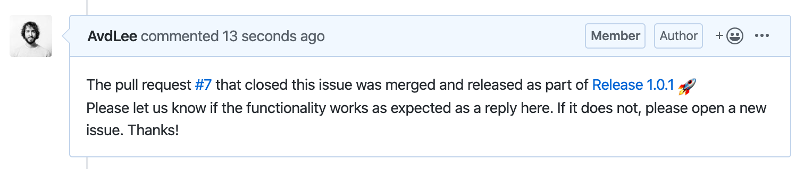
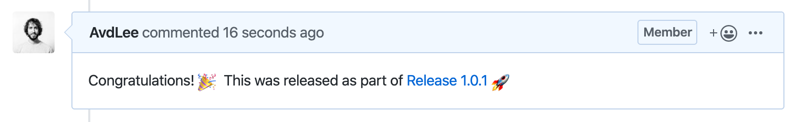

# GitBuddy
Your buddy in managing and maintaining GitHub repositories.

<p align="center">


</p>

GitBuddy helps you with:

- [x] Generating a changelog
- [x] Converting a tag into a GitHub release with a changelog attached
- [x] Commenting on issues and PRs when a releases contained the related code changes

### Generating a changelog
```
$ gitbuddy changelog --help
OVERVIEW: Create a changelog for GitHub repositories

OPTIONS:
  --base-branch, -b   The base branch to compare with. Defaults to master.
  --help              Display available options
  --since-tag, -s     The tag to use as a base. Defaults to the latest tag.
  --verbose           Show extra logging for debugging purposes
```

This command generates a changelog based on merged PRs and fixed issues. Once a PR contains a reference like `"Fixed #30"`, the title of issue 30 will be included in the changelog. Otherwise, the Pull Request title will be used.

Pull requests that are merged into the `baseBranch` will be used as input for the changelog. Only pull requests that are merged after the creation date of the `sinceTag` are taken as input.

#### A Changelog example
This is an example taken from [Mocker](https://github.com/WeTransfer/Mocker/releases/tag/2.0.1)

----

- Switch over to Danger-Swift & Bitrise ([#34](https://github.com/WeTransfer/Mocker/pull/34)) via @AvdLee
- Fix important mismatch for getting the right mock ([#31](https://github.com/WeTransfer/Mocker/pull/31)) via @AvdLee

----

### Generating a release
```
$ gitbuddy release --help
OVERVIEW: Create a new release including a changelog and publish comments on related issues

OPTIONS:
  --changelog-path, -c    The path to the Changelog to update it with the latest changes
  --help                  Display available options
  --skip-comments, -s     Disable commenting on issues and PRs about the new release
  --use-pre-release, -p   Create the release as a pre-release
  --verbose               Show extra logging for debugging purposes
```

The `release` command can be used to transform the latest tag into a GitHub release including the changelog as a body.
The changelog is generated from all the changes between the latest and previous tag.

#### Updating the changelog file
The changelog is appended to the beginning of the changelog file if a `changelogPath` is passed. It's most commonly set to `Changelog.md`.
It's best to use this on a release branch so you can commit the changes and open a PR.

#### Post comments
A great feature of this release command is the automation of posting comments to issues and PRs that are released with this release.

**A comment posted on an issue**


**A comment posted on a pull request**


### Installation using [Mint](https://github.com/yonaskolb/mint)
You can install GitBuddy using Mint as follows:

```
$ mint install WeTransfer/GitBuddy
```

[Setup a personal access token](https://help.github.com/en/github/authenticating-to-github/creating-a-personal-access-token-for-the-command-line) with the scope set to `repo` only. Add this token as an environment variable `GITBUDDY_ACCESS_TOKEN` by combining your GitHub username with the token:

```ruby
export GITBUDDY_ACCESS_TOKEN="<username>:<access_token>"
```

The token is used with the GitHub API and uses Basic HTTP authentication.

After that you can directly use it by executing it from within the repo you would like to work with:

```
$ gitbuddy --help
OVERVIEW: Manage your GitHub repositories with ease

USAGE: GitBuddy <commands> <options>

SUBCOMMANDS:
  changelog   Create a changelog for GitHub repositories
  release     Create a new release including a changelog and publish comments on related issues
```

### Development
- `cd` into the repository
- run `swift package generate-xcodeproj` (Generates an Xcode project for development)
- Run the following command from the project you're using it for:

```bash
swift run --package-path ../GitBuddy/ GitBuddy --help
```
